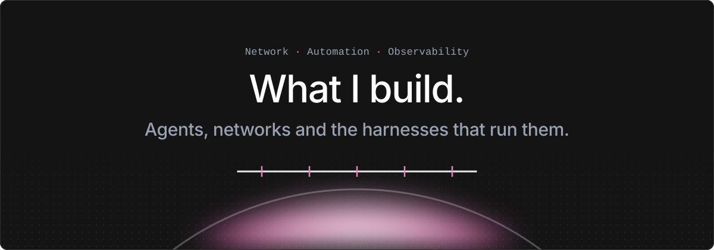

<picture>
  <source media="(prefers-color-scheme: dark)" srcset="assets/hero-dark.svg">
  <source media="(prefers-color-scheme: light)" srcset="assets/hero-light.svg">
  
</picture>

<p align="center"><code>Open source</code> · <code>Self-hosted</code> · <code>Spec-driven with <a href="https://specstride.ai">Specstride</a></code></p>

<sub><code>// 01 · the loop</code></sub>

## Agentic network operations

```text
 intent ─▶ ┌────────┐  CRs  ┌─────────────┐ reconcile ┌────────┐
           │ agents │ ────▶ │ controllers │ ────────▶ │ fabric │
           └───▲────┘       └─────────────┘           └───┬────┘
               │              gNMI telemetry              │
               └──────────────────────────────────────────┘
```

- [agentic-netops](https://github.com/mairp/agentic-netops): AGNTCY and LangGraph agents turn intent into Kubernetes CRs, controllers reconcile them onto a live SONiC EVPN/VXLAN fabric, and gNMI telemetry closes the loop. Runs in containerlab and kind. Built with [Specstride](https://specstride.ai).
- [agentic-netops-srl](https://github.com/mairp/agentic-netops-srl): the same approach on Nokia SR Linux: a declarative EVPN/VXLAN fabric control plane with a guarded multi-agent intent tier. Built with [Specstride](https://specstride.ai).
- [agentic-ops-bench](https://github.com/mairp/agentic-ops-bench): model-by-harness benchmark on real ops tasks (AIOps, NetDevOps, HPC, inference, RAG, tool loops). Local 30B-class models on one RTX 3090 against hosted frontier models.

<sub><code>// 02 · harnesses</code></sub>

## Agent harnesses and infrastructure

- [specstride](https://specstride.ai): spec-driven autonomous coding orchestrator. Drives an agent through Spec Kit phases behind an LLM critic gate, diagnoses stuck phases, and tunes its own per-phase settings.
- [mixture-of-loops](https://github.com/mairp/mixture-of-loops): generates provenance-bound, unattended Specstride pipelines from Spec Kit artifacts, and ships [specstride-batch](https://github.com/mairp/mixture-of-loops/tree/master/skills/specstride-batch) to run that pipeline over batches of features at once. Built with [Specstride](https://specstride.ai).
- [agent-observability-stack](https://github.com/mairp/agent-observability-stack): self-hosted observability for LLM agents and the Linux host running them. Prometheus, Grafana, Loki, Tempo and OTel, with Arize Phoenix as a second trace backend for LLM calls. Metrics and traces for OpenClaw, LiteLLM, Claude Code and RAG.
- [qmd-memory-stack](https://github.com/mairp/qmd-memory-stack) and [qmd-gateway](https://github.com/mairp/qmd-gateway): local GPU-accelerated three-tier RAG memory for coding agents, and a shared writable MCP memory gateway for a multi-agent fleet.
- [claude-plugins](https://github.com/mairp/claude-plugins): Claude Code plugin marketplace, including [antares-scan](https://github.com/mairp/antares-scan), first-pass security triage of a code folder with a local Granite-4.0 1B model.

<sub><code>// 03 · labs</code></sub>

## Network labs

Containerlab labs for Nokia SR OS and SR Linux, built at Nokia and published under [srl-labs](https://github.com/srl-labs).

- [srl-sros-telemetry-lab](https://github.com/srl-labs/srl-sros-telemetry-lab): interactive streaming telemetry lab with SR Linux and SR OS, gNMI into Prometheus and Grafana.
- [sros-anysec-lab](https://github.com/srl-labs/sros-anysec-lab): quantum-safe ANYsec encryption demo on SR OS FP5 vSIMs.
- [sros-anysec-macsec-lab](https://github.com/srl-labs/sros-anysec-macsec-lab): quantum-safe ANYsec and MACsec together in one lab.

<sub><code>// 04 · the fleet</code></sub>

## Agents and skills I use every day

Skills, curated per session through `skillOverrides` profiles — these are the ones that stay on:

- [gpu-ops](https://github.com/mairp/gpu_rtx_3090): operates and inspects the RTX 3090 eGPU — status, free VRAM, drain, safe power cycles — through proven scripts, never ad-hoc commands.
- [speckit-batch](https://github.com/mairp/claude-plugins/tree/master/plugins/speckit-batch): runs a Spec Kit command over a range of specs on a chosen harness and model, several features in parallel.
- [Specstride batch](https://github.com/mairp/mixture-of-loops/tree/master/skills/specstride-batch): runs the full Specstride / Mixture of Loops pipeline over a range of specs — one launch contract per feature, derived and executed unattended on Claude Code or dsh, model and reasoning pinned per run, a shared queue so two harnesses drain batches side by side.
- [mixture-of-loops](https://github.com/mairp/mixture-of-loops): derives the provenance-bound, unattended Specstride pipelines that Specstride batch launches.
- specstride-curate: curates and reconciles a Spec Kit spec corpus for a target host — deterministic backup and cross-artifact checks first, then research agents apply the curation prompt and refresh analyze reports.
- spec-reconcile: writes a dated spec-vs-deployed sheet, read-only and in a fixed vocabulary — the drift audit between what a spec says and what is running.
- [qmd-recall](https://github.com/mairp/qmd-gateway): recall from and write to the shared fleet memory, so every agent on the host inherits prior context and durable gotchas.
- fleet-control: brings the LLM and observability stack up or down and returns a fleet health digest.
- proxmox-ops and proxmox-triage: guarded lifecycle operations (snapshot before risky changes) and read-only diagnosis of Proxmox VMs and containers.
- local-model-ops: which local model to pick on the 3090, when to think longer, and when to escalate to a hosted frontier model.

Agents:

- [Linky](https://github.com/mairp/kedin): drafts a LinkedIn post in my voice every morning and publishes only after I approve it (the link is the public demo).
- Local AI analyst: a weekly buy-or-wait read on local inference hardware against hosted frontier models, checked against written buy triggers and a ledger.
- [Observability digest](https://github.com/mairp/agent-observability-stack): a daily Telegram summary of the agent fleet and its host.
- [Portfolio sync](https://mairp.ai): keeps mairp.ai and its digital twin's knowledge base in step with my public repos, daily.
- Relay: a NetOps and infrastructure agent I reach over Telegram; it works cards from the [kanban](https://github.com/mairp/kanban) board.
- Eterna: agentic RAG over InfiniBand, RDMA, RoCE and HPC material.
- [Havan](https://github.com/mairp/havan): hunts flight deals and returns a ranked shortlist (the link is the public demo).
- Release watcher: polls upstream release tags every 15 minutes and fast-forwards my local clones, never merging or running repo code.
- [video-to-deck](https://github.com/mairp/video-to-deck): turns videos into Marp slide decks using local Whisper, OCR and a fresh agent per video.
- [kanban](https://github.com/mairp/kanban): persistent kanban board with a Claude and Telegram front end.
- [Digital twin](https://mairp.ai): answers questions about my work on mairp.ai.

<sub><code>// 05 · tooling</code></sub>

## Lab tooling

- [kind-cilium-hubble-cluster](https://github.com/mairp/kind-cilium-hubble-cluster): observable Kubernetes cluster with kind, Cilium and Hubble from scratch.
- [gpu_rtx_3090](https://github.com/mairp/gpu_rtx_3090): safe power-cycle scripts for an RTX 3090 Thunderbolt eGPU.
- [certforge](https://github.com/mairp/certforge): small OpenSSL CLI for CSRs and self-signed certificates from a .cnf.

---

<p align="center"><code><a href="https://mairp.ai">mairp.ai</a></code> · <code><a href="https://specstride.ai">specstride.ai</a></code> · <code><a href="https://www.linkedin.com/in/marlon-paz-62b02366/">LinkedIn</a></code></p>
